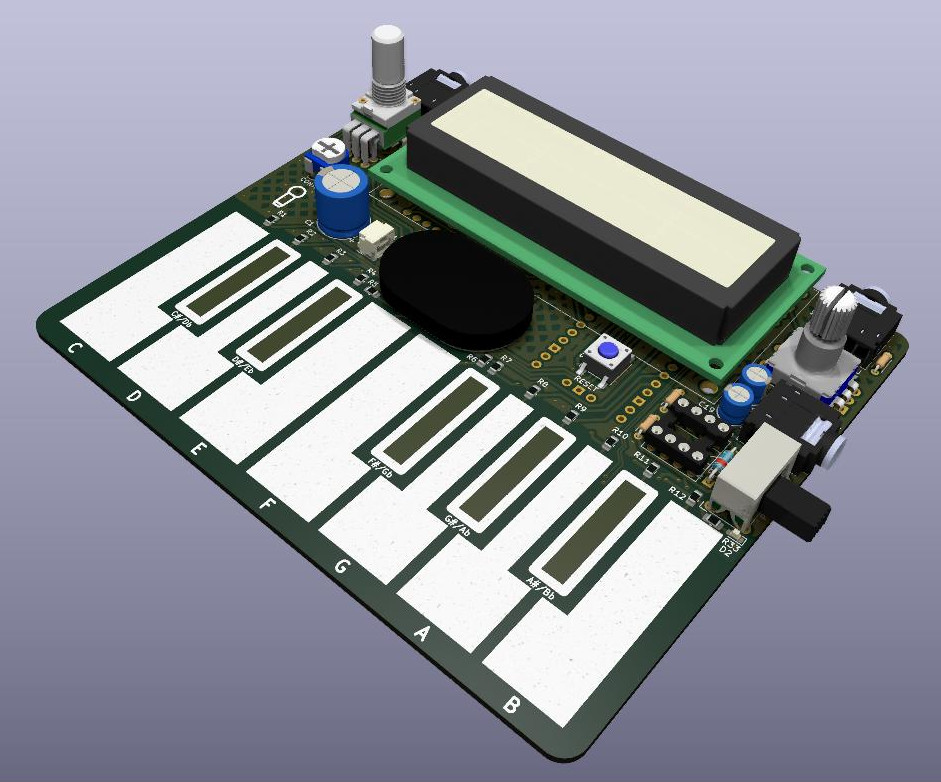
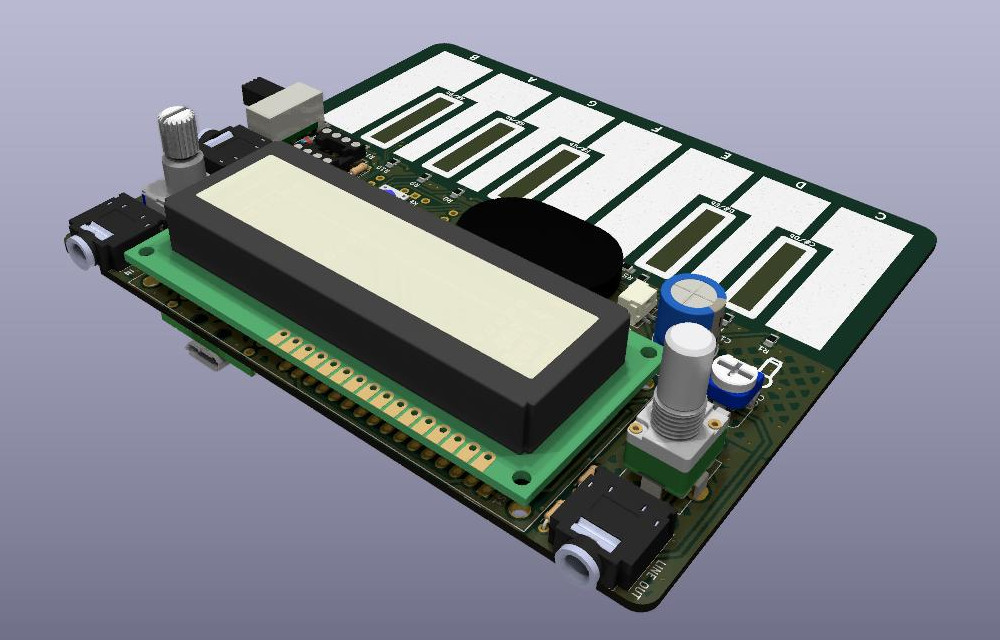
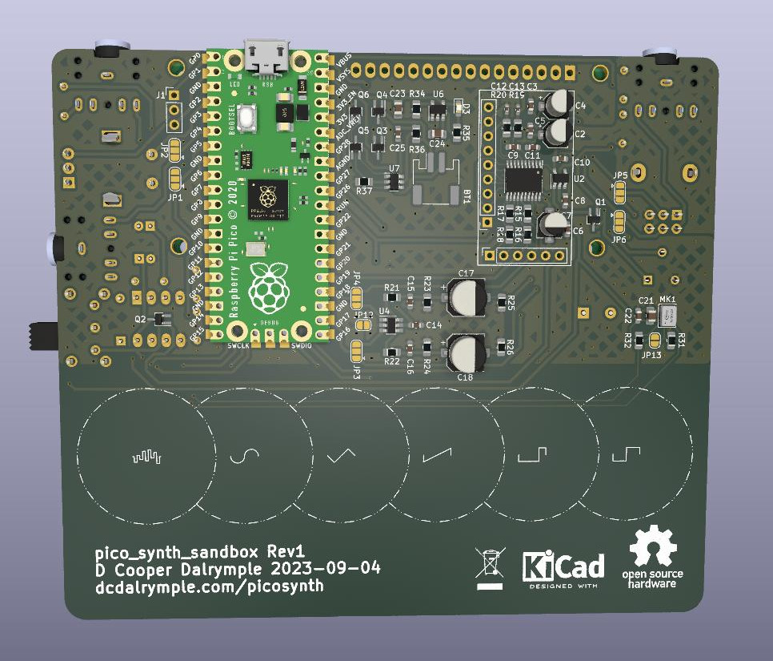
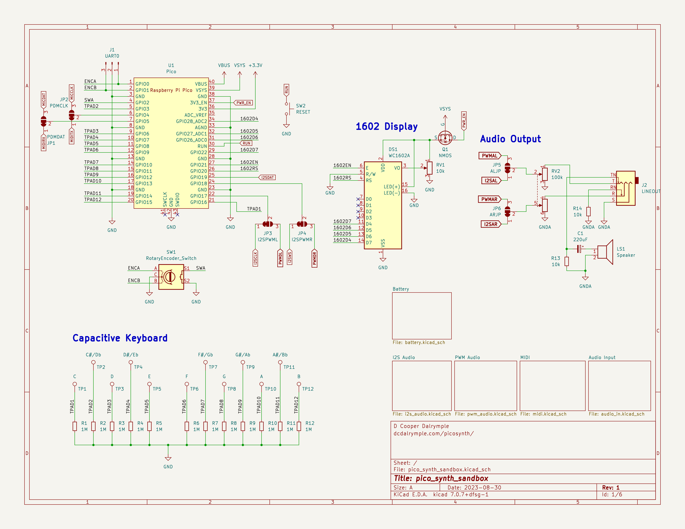

# pico_synth_sandbox
Raspberry Pi Pico digital synthesizer board with I2S or PWM audio, a PDM microphone, MIDI i/o, a capacitive keybed, 1602 display, a rotary encoder, and LiPo battery. Designed for use with CircuitPython and synthio.

## Features
* PCM5102 I2S DAC module compatibility or with populated components
* Optional PWM audio output
* LiPo Battery usb charging and power supply controlled by 3v3_enable
* MIDI input and output via MIDI TRS-A 3.5mm jack (compatible with most adapters)
* Dedicated volume pot with on-board speaker and line output
* 12 capacitive sense touch buttons serving as a single-octave keybed
* Software reset button
* 1602 display and rotary encoder with switch
* Optional PDM Microphone

## RP2040 Pin Assignment
Some pins require solder jumper configuration if you do not use the default pin assignment for MIDI & I2S.

| Pin Reference | Function                                     |
|---------------|----------------------------------------------|
| GP0           | Encoder A (included in UART0 header)         |
| GP1           | Encoder B (included in UART0 header)         |
| GP2           | Encoder Switch                               |
| GP3           | Touch Pad 2 (C#)                             |
| GP4           | MIDITX (UART1) or Microphone PDM Clock (JP2) |
| GP5           | MIDIRX (UART1) or Microphone PDM Data (JP1)  |
| GP6           | Touch Pad 3 (D)                              |
| GP7           | Touch Pad 4 (D#)                             |
| GP8           | Touch Pad 5 (E)                              |
| GP9           | Touch Pad 6 (F)                              |
| GP10          | Touch Pad 7 (F#)                             |
| GP11          | Touch Pad 8 (G)                              |
| GP12          | Touch Pad 9 (G#)                             |
| GP13          | Touch Pad 10 (A)                             |
| GP14          | Touch Pad 11 (A#)                            |
| GP15          | Touch Pad 12 (B)                             |
| GP16          | Touch Pad 1 (C)                              |
| GP17          | I2S Clock or Left PWM (JP3/JP5)              |
| GP18          | I2S Word (LR) Select or Right PWM (JP4/JP6)  |
| GP19          | I2S Data                                     |
| GP20          | 1602 Reset                                   |
| GP21          | 1602 Enable                                  |
| GP22          | 1602 D7                                      |
| GP26          | 1602 D6                                      |
| GP27          | 1602 D5                                      |
| GP28          | 1602 D4                                      |

## Schematic

